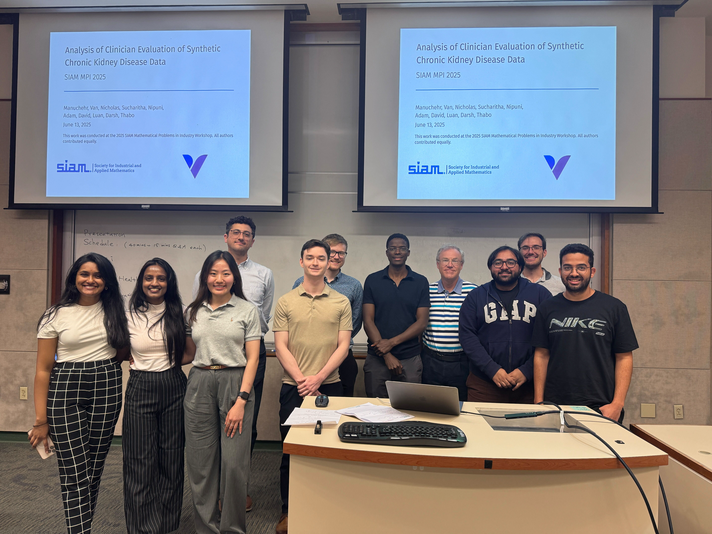
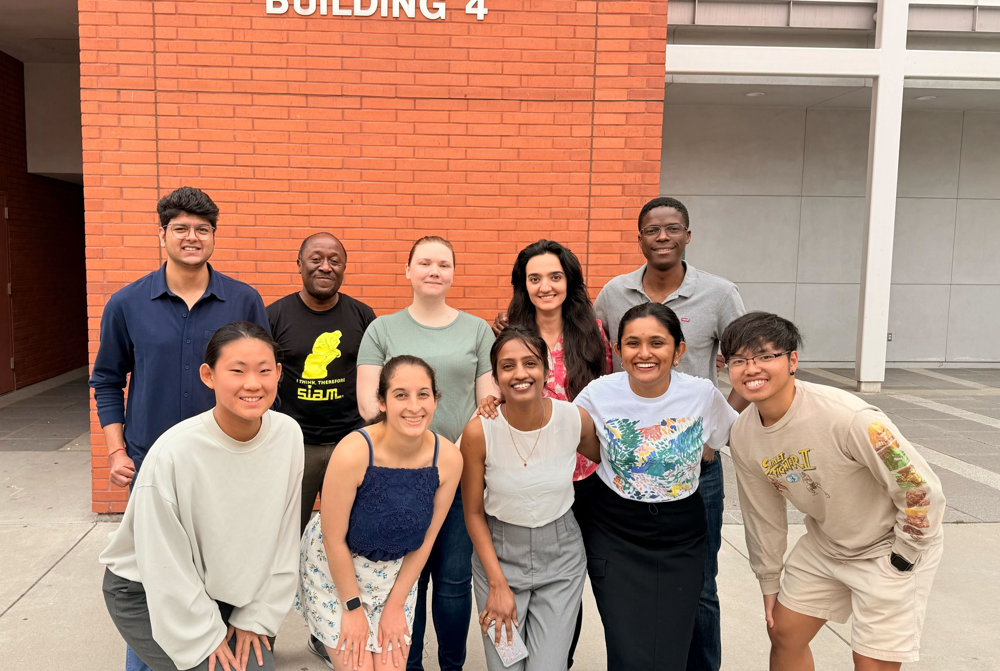
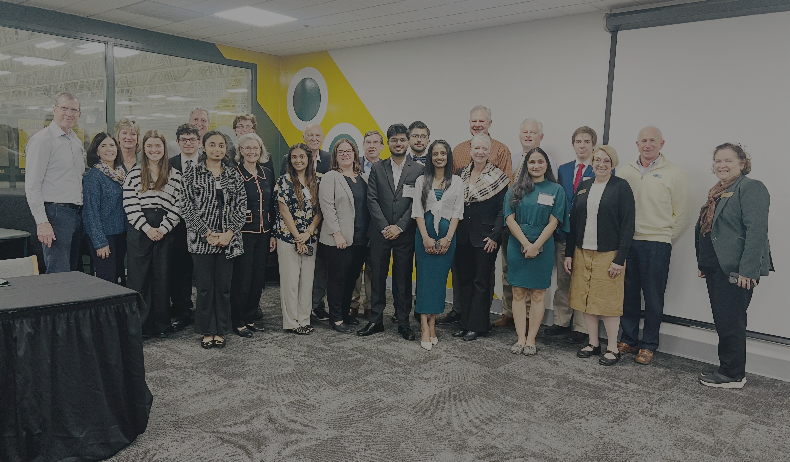
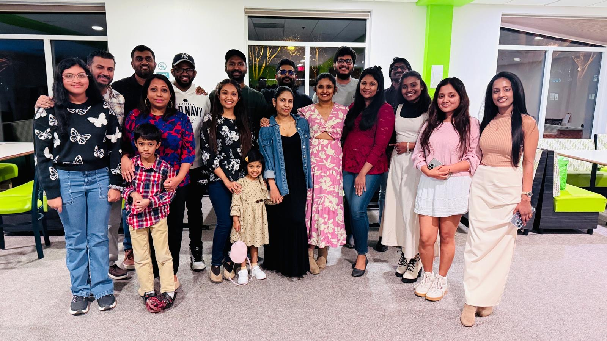

## Workshops & Collaborations

### SIAM Mathematical Problems in Industry (MPI) 2025

_Claremont, CA — June 2025_

  
  
Collaborated with <strong>Manuchehr Aminian</strong>, <strong>Nicholas Harbour</strong>,
  and others on improving synthetic data quality for chronic kidney disease modeling,
  in partnership with Vironix Health.

---

### SIAM Graduate Student Mathematical Modeling Camp (GSMMC) 2025

_Pomona, CA — June 2025_

  
  
Worked with <strong>Lander Besabe</strong>, <strong>Harshit Bhatt</strong>,
  <strong>Kendra Calman</strong>, <strong>Jessie Chen</strong>, and
  <strong>Sucharitha Dodamgodage</strong> on randomized matrix sketching methods
  applied to cancer detection and digit recognition.

---

## Associations

### Graduate Student Association (GSA), Clarkson University

*[Treasurer — 2024–2025](https://www.instagram.com/p/C6qyFKzuVti/) | [Councilor — 2023–2024](https://www.instagram.com/p/CxQhmgYuws0/)*

  
  
As Treasurer of the Graduate Student Association, I managed budgets, coordinated
  events for 150+ participants, and collaborated with faculty and university
  administration to improve graduate student services and programs. I worked closely
  with <strong>Omid</strong>, <strong>Arun</strong>, <strong>Maira</strong>,
  <strong>Taniya</strong>, and <strong>Pooja</strong> across various initiatives
  including travel grants, financial bylaw revisions, and student advocacy.

🔗 [Instagram](https://www.instagram.com/cu.gsa/) · [Website](https://sites.clarkson.edu/cugsa/)

---

### Sri Lankan Student Association (SLSA), Clarkson University

_President — 2024–2025 | Secretary — 2023–2024_

  
  
As President of the Sri Lankan Student Association, I led cross-functional student
  initiatives, coordinated cultural events, and represented the Sri Lankan community
  to university stakeholders. I worked closely with <strong>Kissan</strong>,
  <strong>Uresha</strong>, <strong>Kavindu</strong>, and <strong>Sucharitha</strong>
  to organize events, manage resources, and build a welcoming community for Sri Lankan
  students and the broader Clarkson community.

🔗 [Instagram](https://www.instagram.com/cuslsa24/) · [Knight Life](https://your-knight-life-url)